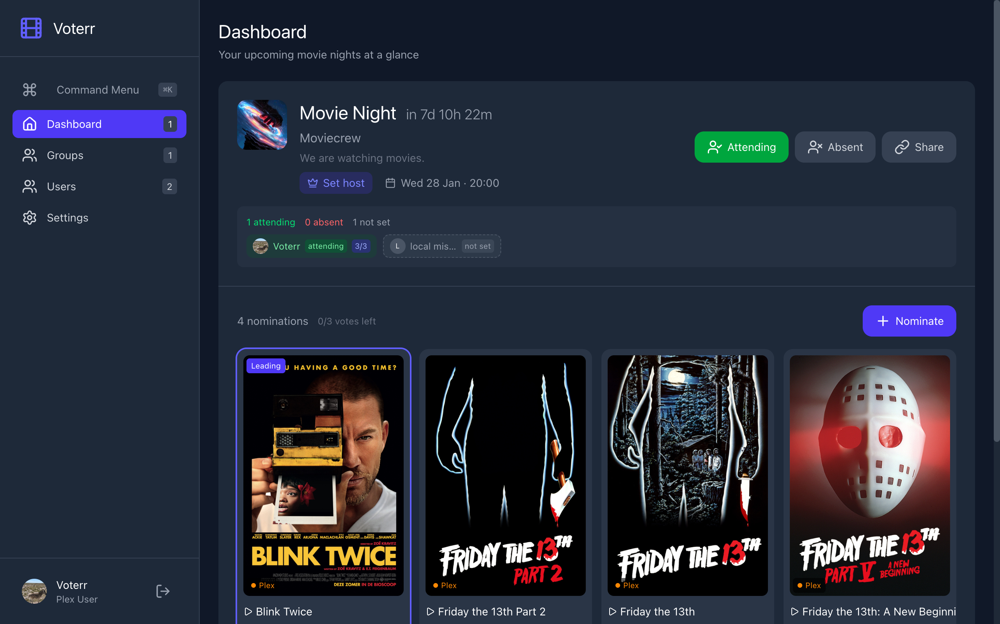
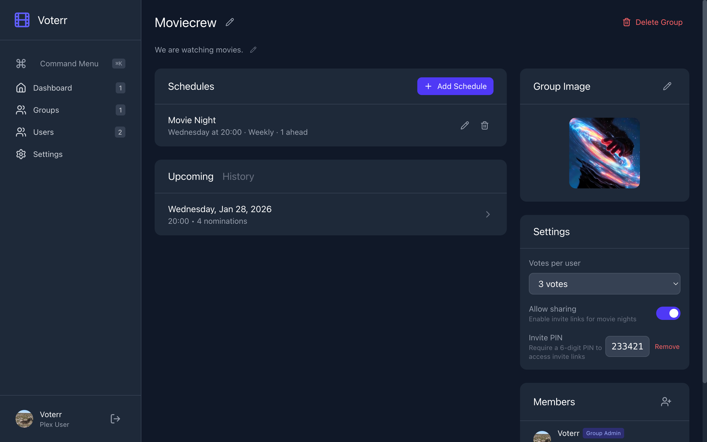
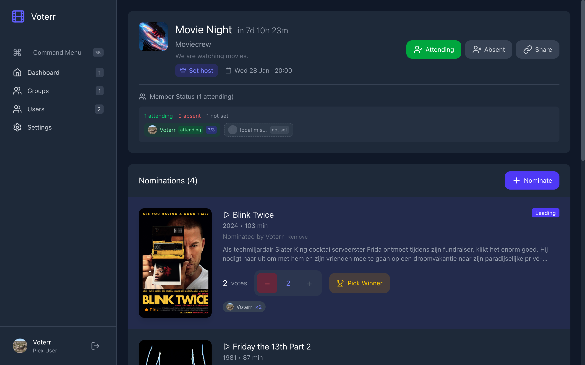

# Voterr

[](https://hub.docker.com/r/tmcrage904/voterr)
[](https://github.com/Tmirage/voterr)

> **Note:** This project is currently in beta/work-in-progress. Features may change and bugs are expected. Feedback and contributions are welcome!

A film voting platform for movie nights that integrates with your Plex ecosystem. Vote on movies, track who's watched what, and organize recurring movie nights with friends.

## Links

- [Docker Hub](https://hub.docker.com/r/tmcrage904/voterr)
- [GitHub Repository](https://github.com/Tmirage/voterr)

## Screenshots

| Dashboard | Group | Movie Night |
|-----------|-------|-------------|
|  |  |  |

## Features

- Plex OAuth authentication
- Import Plex users and create local users for guests
- Create groups for different friend circles
- Recurring and one-off movie night schedules
- Nominate movies via Overseerr or TMDB search
- Vote on nominations with watch history tracking via Tautulli
- Guest access via shareable invite links
- Host assignment with veto power
- Attendance tracking

## Requirements

- Docker
- Plex Media Server with Plex Pass (for OAuth)
- Overseerr or TMDB API key (for movie search) - optional
- Tautulli (for watch history) - optional

## Quick Start

```bash
docker run -d --name voterr -p 5056:5056 -v ./voterr-data:/app/data tmirage/voterr:latest
```

Open `http://localhost:5056` and complete the setup wizard to configure Plex and other services.

## Getting API Keys

### Tautulli API Key
1. Go to Tautulli Settings
2. Navigate to Web Interface
3. Copy the API Key

### Overseerr API Key
1. Go to Overseerr Settings
2. Navigate to General
3. Copy the API Key

### TMDB API Key
1. Create account at themoviedb.org
2. Go to Settings > API
3. Request an API key

## Development

### Prerequisites
- Node.js 20+
- npm

### Setup
```bash
# Install dependencies
npm install
cd client && npm install && cd ..

# Start development servers
npm run dev
```

This starts the frontend dev server with hot reload on `http://localhost:5173`, which proxies API requests to the backend on port 5056.

In production (Docker), the backend serves the built frontend directly on a single port.

### Project Structure
```
voterr/
├── client/                 # React frontend
│   ├── src/
│   │   ├── components/     # Reusable components
│   │   ├── context/        # React context (auth)
│   │   ├── lib/            # Utilities (API client)
│   │   └── pages/          # Page components
│   └── ...
├── server/                 # Express backend
│   ├── db/                 # Database setup
│   ├── middleware/         # Express middleware
│   ├── routes/             # API routes
│   └── services/           # External service integrations
├── data/                   # SQLite database (created at runtime)
├── docker-compose.yml
├── Dockerfile
└── package.json
```

## API Endpoints

### Authentication
- `GET /api/auth/plex` - Initiate Plex OAuth
- `GET /api/auth/plex/callback` - Check Plex auth status
- `GET /api/auth/me` - Get current user
- `POST /api/auth/logout` - Logout

### Users
- `GET /api/users` - List all users
- `GET /api/users/plex-friends` - Get importable Plex friends
- `POST /api/users/import-plex` - Import a Plex user
- `POST /api/users/local` - Create a local user
- `DELETE /api/users/:id` - Delete a user

### Groups
- `GET /api/groups` - List user's groups
- `GET /api/groups/:id` - Get group details
- `POST /api/groups` - Create a group
- `POST /api/groups/:id/members` - Add members
- `DELETE /api/groups/:id/members/:userId` - Remove member
- `DELETE /api/groups/:id` - Delete group

### Schedules
- `GET /api/schedules/group/:groupId` - List group schedules
- `POST /api/schedules` - Create a schedule
- `DELETE /api/schedules/:id` - Delete a schedule
- `GET /api/schedules/movie-nights/group/:groupId` - List movie nights
- `GET /api/schedules/movie-nights/:id` - Get movie night details
- `PATCH /api/schedules/movie-nights/:id` - Update movie night
- `POST /api/schedules/movie-nights/:id/attendance` - Set attendance

### Movies
- `GET /api/movies/library` - Get movies from Overseerr
- `GET /api/movies/search?q=term` - Search movies
- `GET /api/movies/:tmdbId` - Get movie details

### Votes
- `GET /api/votes/movie-night/:id` - Get nominations with votes
- `POST /api/votes/nominate` - Nominate a movie
- `DELETE /api/votes/nominations/:id` - Remove nomination
- `POST /api/votes/vote` - Vote for a nomination
- `DELETE /api/votes/vote/:nominationId` - Remove vote
- `POST /api/votes/movie-night/:id/decide` - Pick winner (host/admin)

### Invites
- `POST /api/invites/create` - Create guest invite link
- `GET /api/invites/validate/:token` - Validate invite
- `POST /api/invites/guest-login` - Login as guest via invite
- `GET /api/invites/movie-night/:id` - List invites for movie night
- `DELETE /api/invites/:id` - Delete invite

## Configuration

| Variable | Description | Default |
|----------|-------------|---------|
| `PORT` | Server port | `5056` |
| `TZ` | Timezone | `Europe/Amsterdam` |

All settings (Plex, Tautulli, Overseerr, TMDB) are configured through the web UI. Session secrets are auto-generated and stored in the database.

## Security

- Session secrets are auto-generated on first run and stored in the database
- Cookies automatically use `secure: true` when accessed via HTTPS (auto-detected via `X-Forwarded-Proto` header)
- All API endpoints require authentication except health check and setup status
- CSRF protection on all POST/PUT/DELETE requests
- Rate limiting on invite link validation (5 requests/minute per IP)
- Rate limiting on PIN attempts (5 failures = 1 minute lockout per IP)
- Groups can require a 6-digit PIN for invite links
- Local invite users can only access their specific movie night
- Image uploads restricted to authenticated non-guest users
- All SQL queries use parameterized statements (no SQL injection)

## Docker Installation

### Using Pre-built Image (Recommended)

```bash
docker run -d \
  --name voterr \
  -p 5056:5056 \
  -v ./voterr-data:/app/data \
  tmirage/voterr:latest
```

That's it! Open `http://localhost:5056` and complete the setup wizard to configure Plex and other services.

### Docker Compose

```yaml
services:
  voterr:
    image: tmirage/voterr:latest
    container_name: voterr
    restart: unless-stopped
    ports:
      - "5056:5056"
    volumes:
      - ./voterr-data:/app/data
```

### Supported Architectures

The Docker image is built for multiple platforms:
- `linux/amd64` - Standard x86_64 servers
- `linux/arm64` - Raspberry Pi 4, Apple Silicon, ARM servers

## License

MIT
